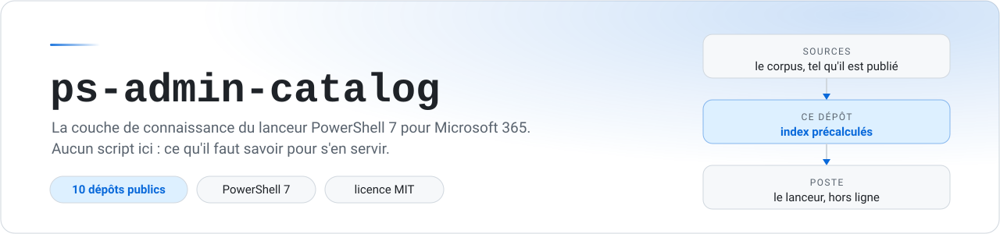

<p align="center">
  <picture>
    <source media="(prefers-color-scheme: dark)" srcset="docs/banner-dark.svg">
    
  </picture>
</p>

<p align="center">
  <a href="../../actions/workflows/validate.yml"></a>
  <a href="../../actions/workflows/build-index.yml"></a>
  <a href="catalog.json"></a>
  <a href="LICENSE"></a>
  
</p>

<p align="center">
  <a href="catalog.json"><b>catalog.json</b></a> &nbsp;·&nbsp;
  <a href="docs/SCHEMA.md">Format</a> &nbsp;·&nbsp;
  <a href="docs/INDEX.md">Index</a> &nbsp;·&nbsp;
  <a href="docs/VERSIONING.md">Versions</a> &nbsp;·&nbsp;
  <a href="CONTRIBUTING.md">Contribuer</a> &nbsp;·&nbsp;
  <a href="CHANGELOG.md">Journal</a>
</p>

---

## Le problème

Les scripts d'administration Microsoft 365 publiés sur GitHub sont bons et dispersés. Dix dépôts, des centaines de fichiers, aucun index commun. Trouver *le* script qui fait la chose, savoir s'il tourne encore sous PowerShell 7, comprendre ce qu'il demande en entrée : c'est à chacun de le refaire, à chaque fois.

Ce dépôt fait ce travail une fois, en public.

> [!NOTE]
> **Aucun script n'est hébergé ici, et rien n'est redistribué.** Ce dépôt contient les références et ce qu'on a appris de chaque source. Les scripts restent chez leurs auteurs et sont téléchargés à la demande, au moment où on les lance.

## Comment ça marche

| Étape | Ce qui se passe |
|---|---|
| **1. Indexation** | Une action GitHub lit les dépôts référencés et publie une fiche par script sur la branche [`index`](../../tree/index) : paramètres, modules requis, cmdlets, date du dernier commit, condensé du fichier. |
| **2. Distribution** | L'application télécharge [`catalog.json`](catalog.json) et les index. Environ un mégaoctet, pas de clone, rien à compiler. |
| **3. Exécution** | Le script lui-même reste en ligne jusqu'au clic. Il est alors téléchargé, son condensé vérifié, puis exécuté. |

C'est le modèle « à la demande » : l'analyse se fait ici, une fois, plutôt que sur chaque poste, à chaque démarrage.

## Brancher l'application

```
https://raw.githubusercontent.com/hbasiitelecom/ps-admin-catalog/main/catalog.json
```

Dans l'application : **⚙** → collez l'URL → **Vérifier maintenant** → **Appliquer la mise à jour**. Une fois par poste.

L'application signale les nouvelles versions sans rien écraser : la mise à jour reste une action de l'utilisateur.

## Les sources indexées

État au 5 septembre 2026. Les compteurs à jour sont dans [`manifest.json`](https://raw.githubusercontent.com/hbasiitelecom/ps-admin-catalog/index/manifest.json).

| Source | Dépôt | Scripts | Licence du dépôt |
|---|---|--:|---|
| Office365ITPros | [`12Knocksinna/Office365itpros`](https://github.com/12Knocksinna/Office365itpros) | 406 | MIT |
| AdminDroid Community | [`admindroid-community/powershell-scripts`](https://github.com/admindroid-community/powershell-scripts) | 183 | *aucune* |
| Microsoft Graph Intune Samples | [`microsoft/mggraph-intune-samples`](https://github.com/microsoft/mggraph-intune-samples) | 63 | MIT |
| MSEndpointMgr | [`MSEndpointMgr/Intune`](https://github.com/MSEndpointMgr/Intune) | 62 | MIT |
| M365Corner | [`m365corner/M365Corner-Scripts`](https://github.com/m365corner/M365Corner-Scripts) | 44 | *aucune* |
| Mike Crowley | [`Mike-Crowley/Public-Scripts`](https://github.com/Mike-Crowley/Public-Scripts) | 38 | GPL-3.0 |
| Devolutions ScriptLibrary | [`Devolutions/ScriptLibrary`](https://github.com/Devolutions/ScriptLibrary) | 19 | *aucune* |
| Exchange4ITPros | [`Apoc70/Exchange4ITPros`](https://github.com/Apoc70/Exchange4ITPros) | 14 | MIT |
| Monkey365 | [`silverhack/monkey365`](https://github.com/silverhack/monkey365) | 2 | Apache-2.0 |
| 365Inspect | [`soteria-security/365Inspect`](https://github.com/soteria-security/365Inspect) | 2 | MIT |

> [!IMPORTANT]
> **Trois de ces dépôts ne déclarent aucune licence.** En l'absence de licence explicite, le droit d'auteur s'applique par défaut : tous droits réservés à leurs auteurs, avec les seuls droits que les conditions de GitHub attachent à un dépôt public. Les exécuter pour administrer son propre tenant correspond à l'usage pour lequel ils sont publiés ; les redistribuer ne l'est pas. Ce catalogue ne redistribue rien. Détails dans [NOTICE.md](NOTICE.md).

## Ce que contient `catalog.json`

| Section | Rôle |
|---|---|
| `sources` | Les dépôts à indexer, avec leur branche et leur niveau de confiance |
| `services` | Les catégories du rail de navigation, déduites des cmdlets de connexion |
| `rules` | Les verdicts de compatibilité PowerShell 7, avec leur explication |
| `tasks` | Les tâches d'administration, et le meilleur script pour chacune |
| `overrides` | Les annotations par script : note d'usage, verdict forcé, renommage, masquage |
| `indexBaseUrl` | Où l'application lit les index précalculés |

Référence complète : **[docs/SCHEMA.md](docs/SCHEMA.md)**. Le schéma exécutable est [`schema/catalog.schema.json`](schema/catalog.schema.json) : les éditeurs qui lisent `$schema` offrent l'autocomplétion et la validation à la frappe.

<details>
<summary><b>Organisation du dépôt</b></summary>

```
catalog.json                 le fichier publié - c'est le produit
schema/                      JSON Schema (draft 2020-12)
tools/validate_catalog.py    validateur sans dépendance, utilisé par la CI
tools/Build-SourceIndex.ps1  générateur des index, exécuté par la CI
docs/SCHEMA.md               référence du format
docs/INDEX.md                format des index et modèle « à la demande »
docs/VERSIONING.md           ce qui déclenche un MAJEUR, un MINEUR, un CORRECTIF
CHANGELOG.md                 historique lisible des versions
CONTRIBUTING.md              comment proposer un changement
SECURITY.md                  modèle de menace et signalement
NOTICE.md                    provenance et conditions des dépôts référencés

branche « index »            index précalculés, un par source, plus manifest.json.
                             Produit dérivé, réécrit par l'action, tenu hors de main.
```

`catalog.json` reste **à la racine** volontairement : son URL brute est le contrat avec toutes les installations déjà déployées. La déplacer casserait chaque poste configuré.

</details>

<details>
<summary><b>Versions</b></summary>

`catalogVersion` suit le [versionnage sémantique](https://semver.org/lang/fr/). Le point propre à ce catalogue :

> **Retirer ou renommer l'`id` d'une source impose une version MAJEURE.** Les favoris et l'historique des utilisateurs désignent les scripts par `<id de source>:<chemin>` : changer l'identifiant les rend orphelins.

`schemaVersion` est un champ distinct : c'est le contrat structurel avec l'application, qui refuse proprement un catalogue trop récent pour elle plutôt que de planter.

Règles complètes dans [docs/VERSIONING.md](docs/VERSIONING.md), historique dans [CHANGELOG.md](CHANGELOG.md).

</details>

<details>
<summary><b>Contribuer</b></summary>

Toute modification passe par une *pull request* et doit franchir la validation automatique.

```bash
python3 tools/validate_catalog.py catalog.json --check-format
```

Le validateur vérifie ce qu'un schéma seul ne voit pas : unicité des identifiants, existence de la source référencée par chaque annotation, compilation effective de chaque expression régulière, absence de motifs à explosion combinatoire, et incrémentation cohérente de `catalogVersion`.

Détails dans [CONTRIBUTING.md](CONTRIBUTING.md).

</details>

## Licence et provenance

Le contenu de ce dépôt - schéma, validateur, documentation, catalogue - est sous [licence MIT](LICENSE).

**Aucun code tiers n'est redistribué ici.** Les scripts référencés restent soumis aux conditions de leurs dépôts d'origine, que ce catalogue ne modifie ni n'étend. La licence de chaque source est indiquée dans le tableau ci-dessus et détaillée dans [NOTICE.md](NOTICE.md).

Projet indépendant, sans affiliation avec aucun des éditeurs référencés. Si vous êtes l'auteur d'un dépôt indexé et souhaitez qu'il en sorte, [ouvrez un ticket](../../issues/new) : la source est retirée dans la version suivante.
